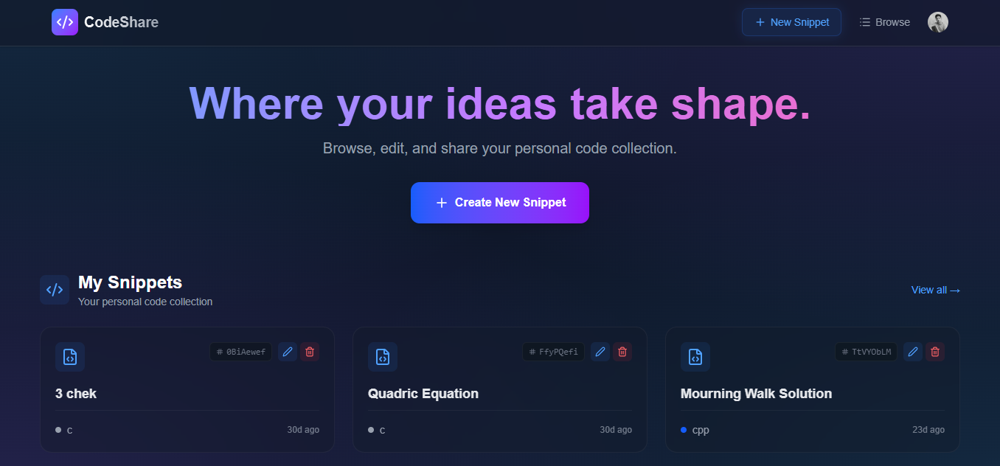
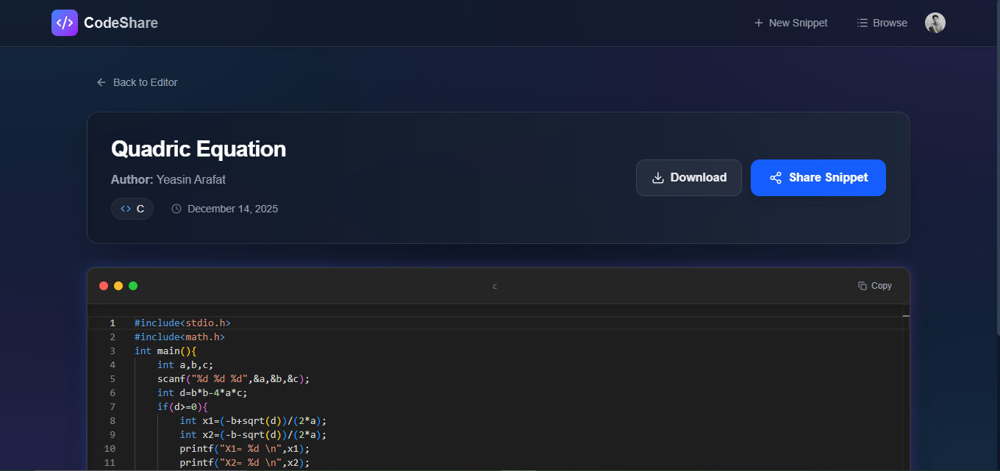
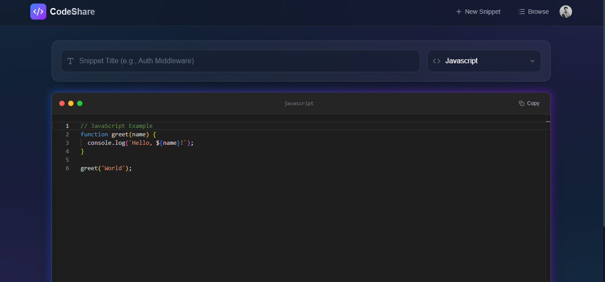

# 🚀 CodeShare



> **A Code Snippet Manager for Competitive Programmers & Developers.**

[](https://code-share-y.vercel.app) 
[](https://github.com/yeasinarafat1/CodeShare)

---

## 💡 The Problem & Solution
As a Competitive Programmer, I often found myself rewriting the same algorithms (Dijkstra, Segment Trees, BFS) or losing track of my old solutions. 

**CodeShare** solves this by providing a personal cloud library where developers can:
1.  **Store** their reusable algorithms with syntax highlighting.
2.  **Access** them from any device during practice sessions.
3.  **Share** solutions with peers via public links.

---

## 📸 Screenshots
| **Dashboard** |

 |  **Code Editor** | 

---

## ✨ Key Features
* **🔐 Secure Auth:** Complete user management via **Clerk** (Social Login + Session Handling).
* **⚡ High Performance:** Built on **Next.js App Router** with Server Actions for zero-API-latency interactions.
* **🎨 Developer UX:** Dark-mode enabled interface with **Monaco Editor** (VS Code's engine) for a native coding experience.
* **🛡️ Type Safety:** Full end-to-end type safety using **TypeScript** and **Drizzle ORM**.
* **🌍 Global Access:** Snippets are publicly shareable via unique generated slugs.
## ✨ Key Features
* **🔐 Secure Auth:** Complete user management via **Clerk** (Social Login + Session Handling).
* **⚡ High Performance:** Built on **Next.js App Router** with Server Actions for zero-API-latency interactions.
* **🎨 Developer UX:** Dark-mode enabled interface with **Monaco Editor** (VS Code's engine) for a native coding experience.
* **🛡️ Type Safety:** Full end-to-end type safety using **TypeScript** and **Drizzle ORM**.
* **🌍 Global Access:** Snippets are publicly shareable via unique generated slugs.

---

## 🛠 Tech Stack

| Category | Technology | Reason for Choice |
| :--- | :--- | :--- |
| **Framework** | Next.js 14 (App Router) | For Server Components and SEO-friendly routing. |
| **Database** | Neon (PostgreSQL) | Serverless Postgres that scales to zero when not in use. |
| **ORM** | Drizzle | Lightweight, type-safe SQL wrapper (faster than Prisma). |
| **Auth** | Clerk | Best-in-class security without maintaining custom JWTs. |
| **Styling** | Tailwind CSS | Rapid UI development and consistent design system. |
| Category | Technology | Reason for Choice |
| :--- | :--- | :--- |
| **Framework** | Next.js 14 (App Router) | For Server Components and SEO-friendly routing. |
| **Database** | Neon (PostgreSQL) | Serverless Postgres that scales to zero when not in use. |
| **ORM** | Drizzle | Lightweight, type-safe SQL wrapper (faster than Prisma). |
| **Auth** | Clerk | Best-in-class security without maintaining custom JWTs. |
| **Styling** | Tailwind CSS | Rapid UI development and consistent design system. |

---

## 📂 Project Structure
## 📂 Project Structure

```bash
```bash
codeshare/
├── app/                  # Next.js App Router
│   ├── (auth)/           # Route groups for Sign-in/up
│   ├── snippets/         # Protected snippet routes
│   └── api/              # Webhooks
├── db/                   # Database Schema & Migrations
│   ├── schema.ts         # Drizzle Schema definitions
├── lib/                  # Shared utilities
│   ├── actions/          # Server Actions (Mutations)
├── components/           # Reusable UI Components
└── drizzle.config.ts     # DB Configuration

```

----------

## ⚙️ Getting Started

To run this project locally:

1.  **Clone the repo**
    
    Bash
    
    ```
    git clone [https://github.com/your-username/codeshare.git](https://github.com/your-username/codeshare.git)
    cd codeshare
    
    ```
    
2.  **Install dependencies**
    
    Bash
    
    ```
    npm install
    
    ```
    
3.  **Set up Environment Variables**
    
    Create a `.env` file in the root and add your keys:
    
    Code snippet
    
    ```
    NEXT_PUBLIC_CLERK_PUBLISHABLE_KEY=pk_test_...
    CLERK_SECRET_KEY=sk_test_...
    DATABASE_URL=postgresql://...
    
    ```
    
4.  **Push Database Schema**
    
    Bash
    
    ```
    npx drizzle-kit push
    
    ```
    
5.  **Run the Server**
    
    Bash
    
    ```
    npm run dev
    
    ```
    
├── app/                  # Next.js App Router
│   ├── (auth)/           # Route groups for Sign-in/up
│   ├── snippets/         # Protected snippet routes
│   └── api/              # Webhooks
├── db/                   # Database Schema & Migrations
│   ├── schema.ts         # Drizzle Schema definitions
├── lib/                  # Shared utilities
│   ├── actions/          # Server Actions (Mutations)
├── components/           # Reusable UI Components
└── drizzle.config.ts     # DB Configuration

```

----------

## ⚙️ Getting Started

To run this project locally:

1.  **Clone the repo**
    
    Bash
    
    ```
    git clone [https://github.com/your-username/codeshare.git](https://github.com/your-username/codeshare.git)
    cd codeshare
    
    ```
    
2.  **Install dependencies**
    
    Bash
    
    ```
    npm install
    
    ```
    
3.  **Set up Environment Variables**
    
    Create a `.env` file in the root and add your keys:
    
    Code snippet
    
    ```
    NEXT_PUBLIC_CLERK_PUBLISHABLE_KEY=pk_test_...
    CLERK_SECRET_KEY=sk_test_...
    DATABASE_URL=postgresql://...
    
    ```
    
4.  **Push Database Schema**
    
    Bash
    
    ```
    npx drizzle-kit push
    
    ```
    
5.  **Run the Server**
    
    Bash
    
    ```
    npm run dev
    
    ```
    

----------

## 🧑‍💻 Author

**Yeasin Arafat** _Full Stack Developer & Competitive Programmer_ [LinkedIn Profile](https://www.linkedin.com/in/yeasinarafat27) | [GitHub Profile](https://github.com/yeasinarafat1)


```